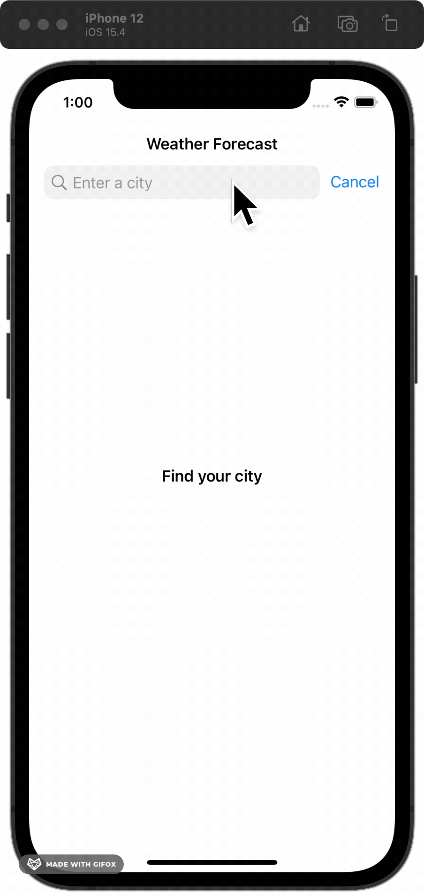

# Demo

	

# Installation

No third library so install and run it is simple, just open the `Weather.xcodeproj` file and choose simulator then press run button.

# Functionalities completed
- [x] The application is a simple iOS application which is written by Swift.
- [x] The application is able to retrieve the weather information from OpenWeatherMaps API.
- [x] The application is able to allow user to input the searching term.
- [x] The application is able to proceed searching with a condition of the search term length must be
from 3 characters or above.
- [x] The application is able to render the searched results as a list of weather items.
- [x] The application is able to support caching mechanism so as to prevent the app from
generating a bunch of API requests.
- [x] The application is able to manage caching mechanism & lifecycle.
- [x] The application is able to handle failures.
- [x] The application is able to support the disability to scale large text for who can't see the
text clearly.
- [x] The application is able to support the disability to read out the text using VoiceOver
controls.

**More technical completed**
- [x] Unit Tests
- [x] Pull to refresh
- [x] Swift 5.5
- [x] Support from iOS 11.0
- [x] Clean + MVP architecture

# 1. Architecture

The weather app is using Clean + MVP architecture. It is a very clean architecture. It isolates each module from others. Improving code bases or fixing bugs very easy since you only have to update a specific module or specific layer.

Some advantages key of MVP + Clean architecture:
- Good for medium-large teams.
- Scalable. Enable developers to simultaneously work on it seamlessly as possible.
- Easy to add new features.
- Easy to add tests since each layer is separated from the other.
- Easy to track bugs
- Applies SOLID principles.
- Reduces the number of conflicts within the development team.

# 2. Project Structure

- **App:** Contains main app structure such as AppDelegate, SceneDelegate
- **Caching:** Contains weather list cache to cache forecast data to reduce API requests.
- **Networking:** A lightweight URLSession wrapper to work with APIs. Easy to use with different endpoints
- **Scenes:** Contains scenes of the app.
- **UseCases:** Contains use case and repository.
- **Utils:** Contains some utilities.
- **Views:** Contains reusable views.
- **Resources:** Contains resource files such as assets, info.plist, ...
- **WeatherTests:** Unit tests of the application.

# 3. Unit Test

The weather app is using Test Double technique as unit test.

A Test Double is an object that can stand in for a real object in a test, similar to how a stunt double stands in for an actor in a movie.

More info: https://martinfowler.com/bliki/TestDouble.html

# 4. Cache

- We have several caching mechanisms to consider such as key-value cache, LRU cache, local database, keychain...
- In this app, we just need to cache the forecasts data to reduce APIs calls, we don't care about security since not any data that really important, so key-value cache is the best fit for us since:
  - Easy to implement
  - Easy to use
  - Very lightweight, it does not affect the storage of user's devices.
- The cache layer is using the hash map to get and set data with fast access, insert time complexity constant time in the best case and linear time in the worst case.
- The cache layer has default expired time is 10 minutes but we can modify it as we want.

# Test Coverage: 86.2%

